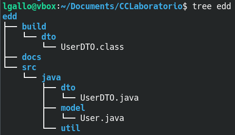

# LABORATORIO DE CIENCIAS DE LA COMPUTACIÓN

## Introducción

El presente almacén contiene las plantillas de las prácticas del laboratorio de los cursos de *Introcucción a las Ciencias de la Computación* y *Estructuras de Datos*.

Además, se incluye información util de configuración del entorno, manejo básico de la Konsola en ambientes linux, para administrar directorios, usar git y el Kit de Desarrollo de Java (JDK).
 

Para una fácil navegación revisa cada apartado de acuerdo a la materia que estés cursando:

- [Introducción a las Ciencias de la Computación](#introdución-a-las-ciencias-de-la-computación)
- [Estructuras de Datos](#estructuras-de-datos)

Índide de contenido variado que sirve de auxiliar para ambos cursos, ubicado en la carpeta _miscelanea_:

- [Comandos básicos para una konsola en Linux]
- [Comandos JDK]
- [Configuración de git]

 
## Contenido de la carpeta miscelanea

 
## Introducción a las Ciencias de la Computación

_En construcción ..._

 
## Estructuras de Datos

Árbol de directorios del curso, un estatus parcial para la práctica 1.

